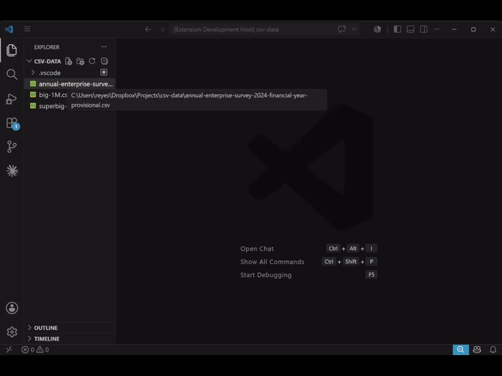

# The CSV Sheet Show

> A surprisingly serious and fast table viewer, editor and data manipulation tool right inside VS Code.

Double-click a `.csv` file in Visual Studio Code and get a clean, scrollable spreadsheet. No leaving your editor, no spinning up a separate app, no "please wait while we load 4 million rows."



## Why you'll like it

CSV files are everywhere and almost always annoying to work with. The CSV Sheet Show extension turns them into something you can actually read, search, edit and query — fast, even when the files are enormous.

## Features

### Open massive files instantly
- **Opens enormous CSVs with millions of rows in less than a second**: scrolling stays smooth no matter how deep you go.
- **The header row stays pinned** as you scroll, so you never lose track of which column is which.
- **Resize columns to fit your data**, and **your column configuration is remembered** the next time you open that file.
- **Customize any column's style and text/background colors** to make key data stand out.

### It just figures out your file
- **Auto-detects the headers, the separator, the text encoding, and even the line endings**: Is your CSV file encoded in UTF-8, UTF-16, Latin-1, Windows-1252, Big5, Shift-JIS, or something else? Is it separated by commas, semicolons, or tabs? You just don't have to worry about it.
- **Wrong guess? Override anything in one click**, and **remember your choice** just for this file, or for every similar file in your workspace.

### Find anything, fast
- **Search that understands columns**, with match case, whole word, and full regular-expression support.
- **Narrow your search to specific columns** when you know where to look.
- **Filter mode hides non-matching rows**, so you can get rid of the noise and see only the rows you care about.

### Edit right in the grid
- **Starts in a safe read-only view**, and lets you turn on editing only when you actually want to make changes, so you never fat-finger a file you only meant to look at.
- **Edit cells like a spreadsheet**, complete with an **Excel-style formula bar** for comfortable multi-line edits, and **undo/redo** for every change.
- **Rename and edit headers**, or add a header row to a file that never had one.
- **Insert rows above or below, and delete rows** from a handy toolbar or right-click menu.
- **Your edits save straight back to the original `.csv`.**

### Make it readable
- **Style any column with its own alignment and text/background colors** from a curated palette. Perfect for making key columns pop and helping you read the data at a glance.
- **Your column widths and styles are remembered per file**, so your tables look the way you left them every time you reopen them.

### Query it like a database
- **Open a DuckDB SQL session on your file in one click**: it loads into an integrated terminal, ready to query, with no separate import step.
- **Run real SQL**: filters, joins, aggregates, the works, against even huge files, powered by [DuckDB](https://duckdb.org).
- **Choose how the file is mounted**: a fast in-memory snapshot, or a live view that re-reads the file on every query.
- **Pick the table name and decimal separator** to match how you want to work. Options come pre-filled with sensible defaults inferred from your file.
- Uses `duckdb` from your PATH by default, or **point it at your own install** with the `csv-sheet-show.duckdbPath` setting. (Requires DuckDB to be installed.)

### Export without leaving the editor
- **Turn your table into JSON or polished HTML** in seconds.
- **JSON, your way**: Be it an array of objects, an array of arrays, or newline-delimited JSON, with control over key naming, indentation, and how empty cells are written.
- **HTML, ready to paste**: a bare table fragment, a self-styled fragment, or a complete document, with your column alignment and colors carried straight into the CSS.
- **Pick exactly which columns and rows to include** (including just your filtered results).
- **Send the result to a file or copy it to the clipboard.**
- **Your original file is never modified**: exports are always a clean, separate copy.

### Feels right at home
- **Matches your VS Code theme**: light, dark, and high-contrast all look great.
- **Bundles everything it needs**: no extra packages to install for the core experience (the optional DuckDB query tool is the one feature that reaches for an external program).

## Give it a try

1. Install The CSV Sheet Show:
   - Download it from the Marketplace, **or**
   - Build it yourself from the source:
     ```bash
     npm install
     npm run create-vsix
     ```
     Then install the generated `.vsix` from the Extensions view (select *Install from VSIX...*).
2. Open any `.csv` file in VS Code.

## Open source

The CSV Sheet Show is **open source under the [Apache License 2.0](LICENSE)** and built in the open. Found a bug, want a new export format, or have an idea to make it nicer? Issues and pull requests are very welcome.

## Status

**Version `1.0.0`**: this initial release is feature-complete and stable. Please report any bugs you find, and share what features you'd like to see next.
